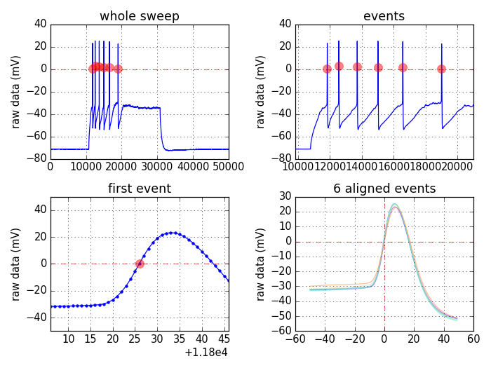
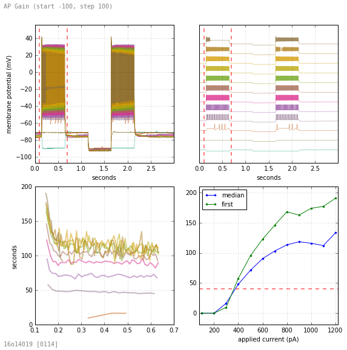
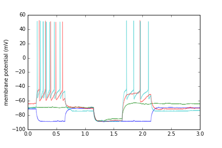

# SWHLab
SWHLab is a python module designed to ***facilitate exploratory analysis of electrophysiological data*** by providing a simple object model through which to interact with it. It is intended to be used as a tool for neurophysiology data exploration, rather than production or presentation. The primary goal of this project is to lower the effort barrier required to impliment experimental analysis methods, with the hope of faciliating scientific discovery by promoting the development of novel analysis techniques. 

 |  |  
---|---|---

 | 
---|---

# Examples
For additional examples, see my [real-world use cases](doc/uses) where I used SWHLab to create one-off analysis routines to test an experimental analysis idea. Note that the docs are not yet ready, nor is the cookbook :(

### Accessing Data
_Display all recorded values from the first 5 sweeps._
**Code:**
 > ```python
import swhlab
abf=swhlab.ABF("16907055.abf")
for sweep in range(5):
    abf.setsweep(sweep)
    print(abf.sweepY.astype('float'))
```

**Output:**
 > ```
[-71.4722 -71.4722 -71.5027 ..., -69.7021 -69.7021 -69.7632]
[-69.7327 -69.7327 -69.7327 ..., -64.1174 -64.1479 -64.1174]
[-64.1174 -64.1479 -64.1174 ..., -70.282  -70.3125 -70.282 ]
[-70.282  -70.282  -70.282  ..., -73.3643 -73.3337 -73.3032]
[-73.3337 -73.3032 -73.3643 ..., -75.0122 -74.9817 -74.9817]
```

## Plotting Data with MatPlotLib
_Plot recorded data from the first 4 sweeps. Note that the ABF class can provide raw time points (abf.sweepX) or time-in-sweep points (abf.sweepX2). Also, deteciton of voltage-clamp vs. current-clamp is automatic, and abf.units2 will provide a name suitable for an axis label.
**Code:**
 > ```python
import swhlab
import matplotlib.pyplot as plt
abf=swhlab.ABF("16907055.abf")
for sweep in range(4):
    abf.setsweep(sweep)
    plt.plot(abf.sweepX2,abf.sweepY,alpha=.5)
plt.ylabel(abf.units2)
plt.show()
```

**Output:**
 > 

## Action Potential Detection
_Use the AP detection class to detect APs in all sweeps, then plot the median frequency (by sweep) of APs in the first 15 sweeps._
**Code:**
 > ```python
import swhlab
import matplotlib.pyplot as plt
import numpy as np
ap=swhlab.AP("16907055.abf")
ap.detect()
medFreq=[np.median(f) for f in ap.get_bySweep("freqs")]
plt.plot(medFreq[:15],'.',ms=10)
plt.ylabel("Median AP Frequency (Hz)")
plt.xlabel("sweep number")
plt.show()
```

**Output:**
 > 

# Details

**Scope:** Although initially designed to analyze whole-cell patch-clamp recordings of neurons from ABF (axon binary format) files, the core class within this module may be eaily modified to accommodate another recording method or file format. SWHLab leans heavily on the [NeoIO](https://pythonhosted.org/neo/io.html) module to provide low-level file access, and therefore is likely to support other electrophysiological file formats with minimal modifiation.

**Data access:** The core of SWHLab is the `swhlab.ABF` class which has tools that make it easy to obtain sweep data, information from the header, protocol information, protocol sweeps, sub-sections of sweeps, averages of ranges of sweeps, baseline-subtracted sweeps, low-pass-filtered sweeps, amplifier information, tag times and comments, etc.

**Event detection:** Event detection classes live in the analysis folder and can be imported as needed. For example, the action potential detection class can be initiated with an ABF object and perform many high level operations:

**Protocol detection and data inspection:** If an experiment has thousands of data files, was performed a long time ago, or was conducted by another researcher, it is often useful to quickly inspect the contents of the data. Manually inspecting electrophysiology data can be tedious. The SWHLab module has a _protocols_ sub-module and an _indexing_ sub-module which simplifies this task by:
 1. automatically determine how to analyze a file
  * i.e., if it's current clamp and contains action potentials, analyze it as such
 2. perform the analysis without user input and save the result as a JPG
 3. after potentially thousands of files are analyzed, create a flat-file HTML report which can view the data in any browser
Note that because this entire process can occur without user input, it can be performed automatically as new data is being recorded. This allows operators at the electrophysiology rig to view the results of complicated analysis routines immediately after the data is saved.
