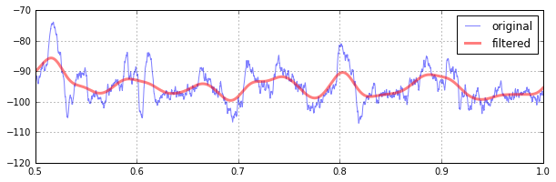
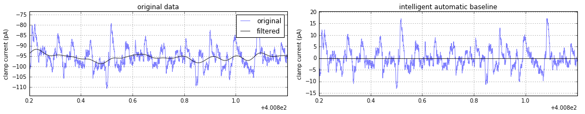
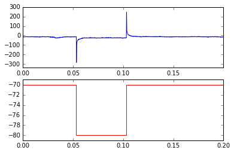

# SWHLab
SWHLab is a python module designed to ***facilitate exploratory analysis of electrophysiological data*** by providing a simple object model through which to interact with it. It is intended to be used as a tool for neurophysiology data exploration, rather than production or presentation. The primary goal of this project is to lower the effort barrier required to implement experimental analysis methods, with the hope of facilitating scientific discovery by promoting the development of novel analysis techniques. 

 |  |  
---|---|---

## [SWHLabPHP](https://github.com/swharden/SWHLabphp)
SWHLab currently is only used to generate figures from electrophysiology data. A separate development project ([SWHLabPHP](https://github.com/swharden/SWHLabphp)) is being created to interact with these data via a web interface. Eventually I intend to merge the two projects into one.

# Example Usage
For additional examples, see my [real-world use cases](doc/uses) where I used SWHLab to create one-off analysis routines to test an experimental analysis idea. Note that the docs are not yet ready, nor is the cookbook :( All examples assume you start by importing what we typically use:
```python
import swhlab
import matplotlib.pyplot as plt
import numpy as np
abf=swhlab.ABF("16907055.abf") # initiate a SWHLab object by giving it an ABF file
```

## Accessing Data
Display all recorded values from the first 5 sweeps.
```python
for sweep in abf.setsweeps():
    print(abf.sweepY)
```
```
[-71.4722 -71.4722 -71.5027 ..., -69.7021 -69.7021 -69.7632]
[-69.7327 -69.7327 -69.7327 ..., -64.1174 -64.1479 -64.1174]
[-64.1174 -64.1479 -64.1174 ..., -70.282  -70.3125 -70.282 ]
[-70.282  -70.282  -70.282  ..., -73.3643 -73.3337 -73.3032]
[-73.3337 -73.3032 -73.3643 ..., -75.0122 -74.9817 -74.9817]
```

## Plotting Data with MatPlotLib
Plot recorded data from the first 4 sweeps. Note that the ABF class can provide raw time points (abf.sweepX) or time-in-sweep points (abf.sweepX2). Also, detection of voltage-clamp vs. current-clamp is automatic, and abf.units2 will provide a name suitable for an axis label.
```python
for sweep in abf.setsweeps():
    plt.plot(abf.sweepX2,abf.sweepY,alpha=.5)
plt.ylabel(abf.units2)
plt.show()
```


## Signal Filtering
Original data is always available by calling `abf.dataY`. If `abf.kernel` has been set (usually by `kernel_gaussian()`), you can pull the convolution of the sweep and the kernel by accessing `abf.dataYfiltered`. Note that the convolution is only performed if and when this method is called. You can generate/change/disable the kernel at any time, but if left alone it's only generated once.
```python
abf.kernel=abf.kernel_gaussian(sizeMS=100)
plt.plot(abf.sweepX2,abf.sweepY,alpha=.5,label="original")
plt.plot(abf.sweepX2,abf.sweepYfiltered(),alpha=.5,lw=3,color='r',label="filtered")
plt.legend()
```


## Automatic Baseline Subtraction
For event detection, the subtract of a sliding gaussian-weighted window from the original signal is helpful at ensuring the trace is always centered near zero. After `abf.kernel` has been defined (above), this smart baseline subtraction can be accessed via `abf.sweepYsmartbase` and plotted as any other numpy array:
```python
plt.figure(figsize=(15,3))
plt.subplot(121)
plt.title("original data")
plt.plot(abf.sweepX,abf.sweepY,alpha=.5,label="original")
plt.plot(abf.sweepX,abf.sweepYfiltered(),alpha=.8,color='k',label="filtered")
plt.subplot(122)
plt.title("intelligent automatic baseline")
plt.plot(abf.sweepX,abf.sweepYsmartbase(),alpha=.5) # <-- this is all it takes
plt.axhline(0,alpha=.8,color='k')
```


## Accessing / Plotting Protocol
Plot the trace and protocol of the first sweep.
```python
plt.subplot(211)
plt.plot(abf.sweepX,abf.sweepY)
plt.subplot(212)
plt.plot(abf.protoX,abf.protoY,color='r')
```


## Action Potential Detection
Use the AP detection class to detect APs in all sweeps, then plot the median frequency (by sweep) of APs in the first 15 sweeps.
```python
ap=swhlab.AP(abf) # you can use an existing abf object
ap=swhlab.AP("16907055.abf") # or create a new one
ap.detect()
medFreq=[np.median(f) for f in ap.get_bySweep("freqs")]
plt.plot(medFreq[:15],'.',ms=10)
plt.ylabel("Median AP Frequency (Hz)")
plt.xlabel("sweep number")
plt.show()
```


# Details

**Scope:** Although initially designed to analyze whole-cell patch-clamp recordings of neurons from ABF (axon binary format) files, the core class within this module may be easily modified to accommodate another recording method or file format. SWHLab leans heavily on the [NeoIO](https://pythonhosted.org/neo/io.html) module to provide low-level file access, and therefore is likely to support other electrophysiological file formats with minimal modifiation.

**Data access:** The core of SWHLab is the `swhlab.ABF` class which has tools that make it easy to obtain sweep data, information from the header, protocol information, protocol sweeps, sub-sections of sweeps, averages of ranges of sweeps, baseline-subtracted sweeps, low-pass-filtered sweeps, amplifier information, tag times and comments, etc.

**Event detection:** Event detection classes live in the analysis folder and can be imported as needed. For example, the action potential detection class can be initiated with an ABF object and perform many high level operations:

**Protocol detection and data inspection:** If an experiment has thousands of data files, was performed a long time ago, or was conducted by another researcher, it is often useful to quickly inspect the contents of the data. Manually inspecting electrophysiology data can be tedious. The SWHLab module has a _protocols_ sub-module and an _indexing_ sub-module which simplifies this task by:
 1. automatically determine how to analyze a file
  * i.e., if it's current clamp and contains action potentials, analyze it as such
 2. perform the analysis without user input and save the result as a JPG
 3. after potentially thousands of files are analyzed, create a flat-file HTML report which can view the data in any browser
Note that because this entire process can occur without user input, it can be performed automatically as new data is being recorded. This allows operators at the electrophysiology rig to view the results of complicated analysis routines immediately after the data is saved.
