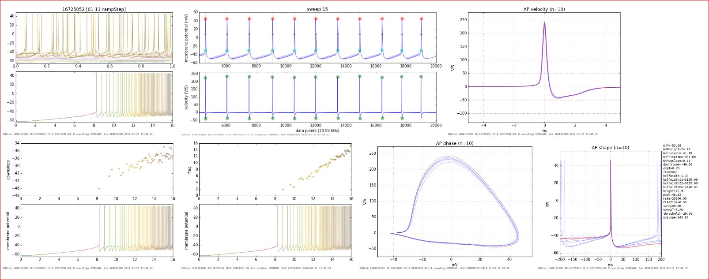
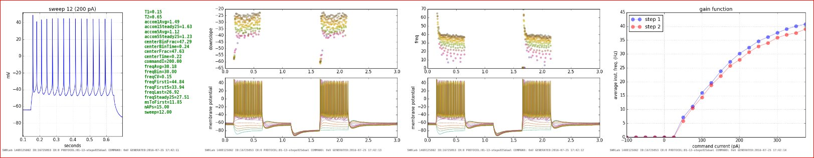
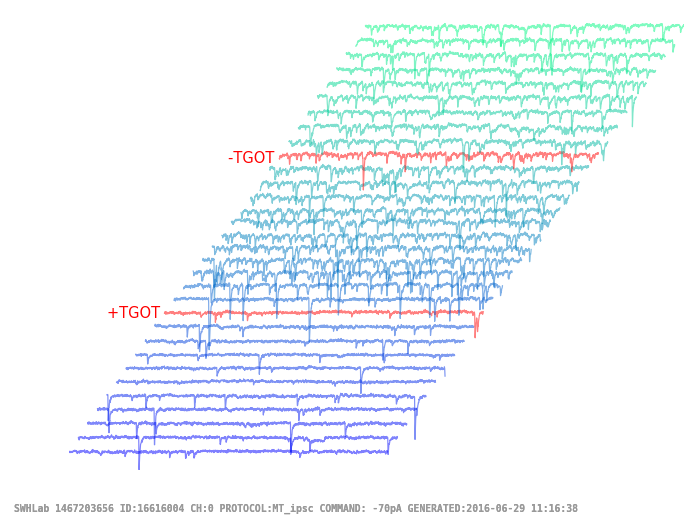

# SWHLab
SWHLab is a python module intended to provide easy access to high level ABF file opeartions to aid analysis of whole-cell patch-clamp electrophysiological recordings. Although graphs can be interactive, the default mode is to output PNGs and generate flat file HTML indexes to allow data browsing through any browser on the network. Direct ABF access was provided by the  [NeoIO](https://pythonhosted.org/neo/io.html) module. _This is a collection of scripts I use for work, and is not intended to be run by anyone other than the author. Source is available for educational purposes only._

## SWHLab and CJFLab
CJFLab is an electrophysiology analysis suite for OriginLab written by Charles Jason Frazier. For more information, see the [github project for CJFLab] (https://github.com/swharden/CJFLab). Many of the scripts in this module depend on functions only available through CJFLab.

## Example Output

