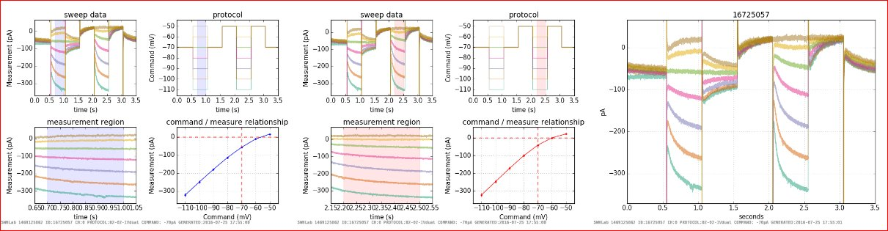

# SWHLab
SWHLab is a python module intended to provide easy access to high level ABF file opeartions to aid analysis of whole-cell patch-clamp electrophysiological recordings. Although graphs can be interactive, the default mode is to output PNGs and generate flat file HTML indexes to allow data browsing through any browser on the network. Direct ABF access was provided by the  [NeoIO](https://pythonhosted.org/neo/io.html) module.

## More Resources
A hodgepodge collection of information is on the temporary website:
* http://swhlab.swharden.com

## Example Output

