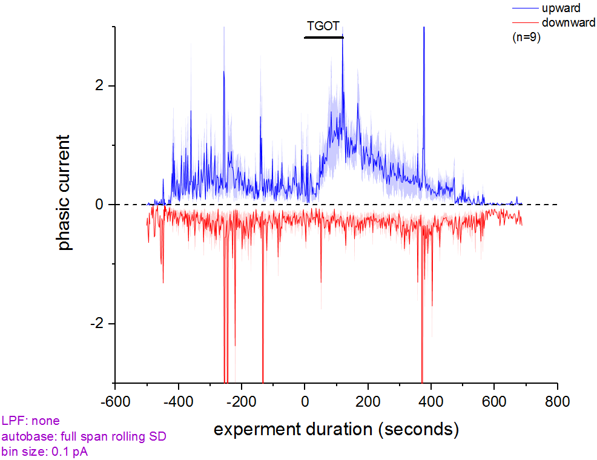
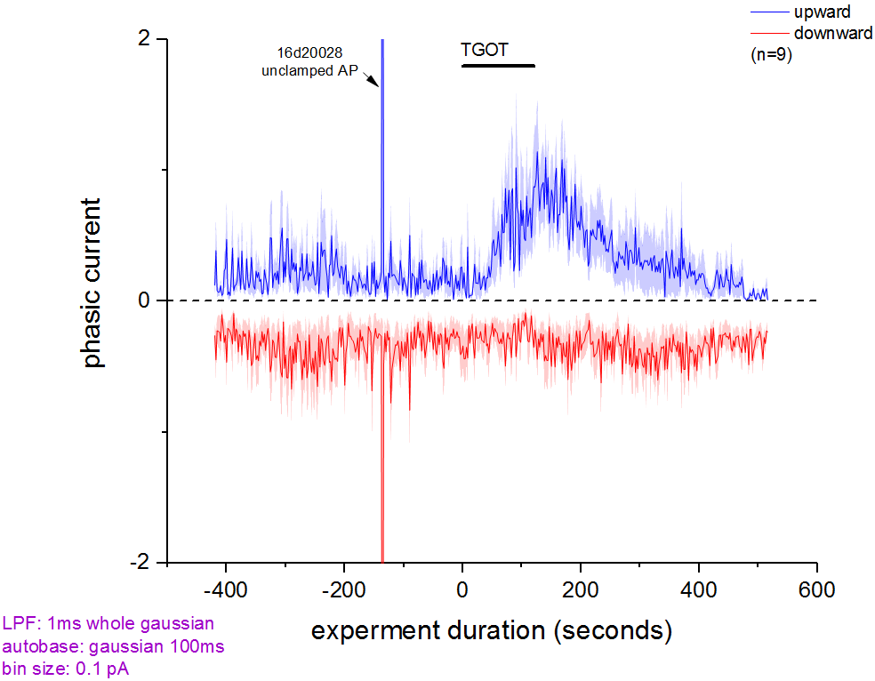
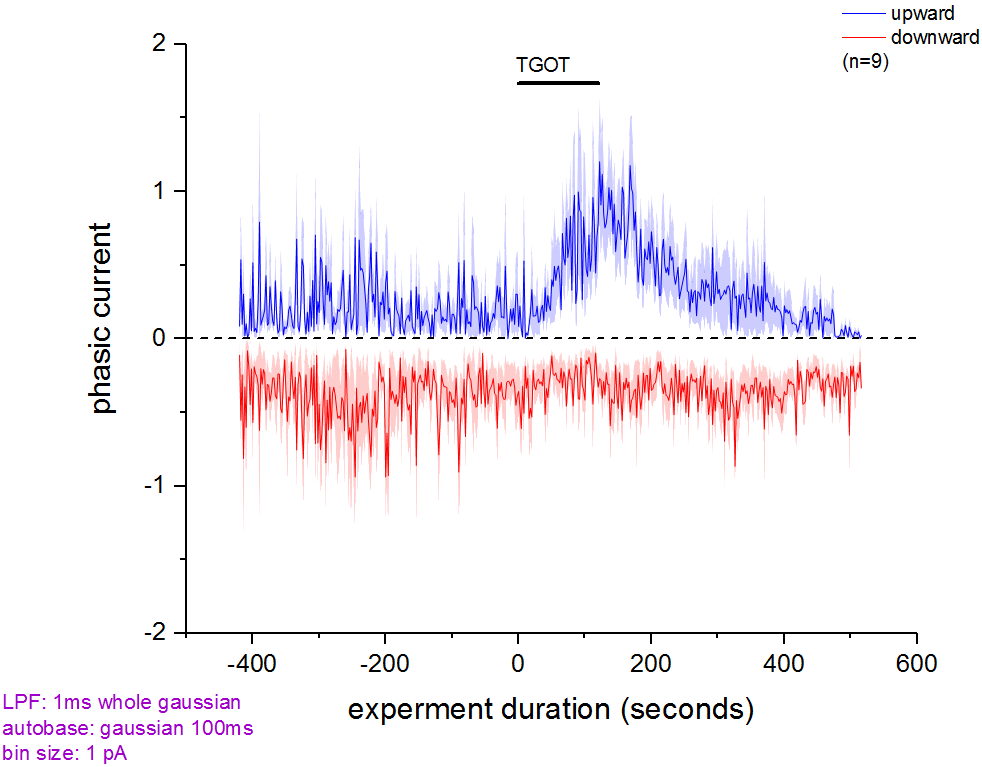

## Typical Analysis of Responsive Cells (via inspection)
```
setpath "X:\Data\2P01\2016\2016-09-01 PIR TGOT\16d14036.abf";  getstats;
setpath "X:\Data\2P01\2016\2016-09-01 PIR TGOT\16d14052.abf";  getstats; 
setpath "X:\Data\2P01\2016\2016-09-01 PIR TGOT\16d16007.abf";  getstats; 
setpath "X:\Data\2P01\2016\2016-09-01 PIR TGOT\16d16011.abf";  getstats; 
setpath "X:\Data\2P01\2016\2016-09-01 PIR TGOT\16d20008.abf";  getstats; 
setpath "X:\Data\2P01\2016\2016-09-01 PIR TGOT\16d20016.abf";  getstats; 
setpath "X:\Data\2P01\2016\2016-09-01 PIR TGOT\16d20020.abf";  getstats;
setpath "X:\Data\2P01\2016\2016-09-01 PIR TGOT\16d20024.abf";  getstats;
setpath "X:\Data\2P01\2016\2016-09-01 PIR TGOT\16d20028.abf";  getstats;

runonsheets _mStats "sc tagTime";
sc getcols _mStats Time PhasicNeg; sc onex; ccave; wks.name$ = PhasicNeg;
sc getcols _mStats Time PhasicPos; sc onex; ccave; wks.name$ = PhasicPos;
```

## Unusual Data Points
- `X:\Data\2P01\2016\2016-09-01 PIR TGOT\16d20028.abf`
 - unstable sweeps: 82, 83
 - unclamped AP: 143

## Output as a function of Autobase Method
description | output
---|---
.1 pA bin, rolling SD autobase|
.1 pA bin, gaussian LPF + gaussian autobase|
1.0 pA bin, gaussian LPF + gaussian autobase|

## Unit Considerations
- assuming 20kHz each point is .05ms
- the phasic value of _each data point_ is ```pA * .05 ms```
- the phasic value of a _range of data_ is the the sum of all points values divided by the time span
 - getting ```sum(points)``` will still yield lots of pA * lots of ms
 - ```(lots of pA) * (lots of ms) / (total ms)```  leaves only pA

### CJF_PCLAMPSWEEP.C code change
NO CODE CHANGE IS NEEDED! Time units are _already_ cancelled out.

**current:**
```C
vecPos.Sum(dPhasicPos);
dPhasicPos/=dNumPtsInRange;
vecNeg.Sum(dPhasicNeg);
dPhasicNeg/=dNumPtsInRange;	
```

**logical:**
```C
vecPos.Sum(dPhasicPos);
dPhasicPos=dPhasicPos*sRate/(dNumPtsInRange*sRate)
vecNeg.Sum(dPhasicNeg);
dPhasicNeg=dPhasicNeg*sRate/(dNumPtsInRange*sRate)
```

## All cells (not just eyeball responders)
```
setpath "X:\Data\2P01\2016\2016-09-01 PIR TGOT\16d14015.abf";  getstats;
setpath "X:\Data\2P01\2016\2016-09-01 PIR TGOT\16d14019.abf";  getstats;
setpath "X:\Data\2P01\2016\2016-09-01 PIR TGOT\16d14027.abf";  getstats;
setpath "X:\Data\2P01\2016\2016-09-01 PIR TGOT\16d14032.abf";  getstats;
setpath "X:\Data\2P01\2016\2016-09-01 PIR TGOT\16d14036.abf";  getstats;
setpath "X:\Data\2P01\2016\2016-09-01 PIR TGOT\16d14040.abf";  getstats;
setpath "X:\Data\2P01\2016\2016-09-01 PIR TGOT\16d14044.abf";  getstats;
setpath "X:\Data\2P01\2016\2016-09-01 PIR TGOT\16d14048.abf";  getstats;
setpath "X:\Data\2P01\2016\2016-09-01 PIR TGOT\16d14052.abf";  getstats;
setpath "X:\Data\2P01\2016\2016-09-01 PIR TGOT\16d14056.abf";  getstats;
setpath "X:\Data\2P01\2016\2016-09-01 PIR TGOT\16d14060.abf";  getstats;
setpath "X:\Data\2P01\2016\2016-09-01 PIR TGOT\16d14064.abf";  getstats;
setpath "X:\Data\2P01\2016\2016-09-01 PIR TGOT\16d16003.abf";  getstats;
setpath "X:\Data\2P01\2016\2016-09-01 PIR TGOT\16d16007.abf";  getstats;
setpath "X:\Data\2P01\2016\2016-09-01 PIR TGOT\16d16011.abf";  getstats;
setpath "X:\Data\2P01\2016\2016-09-01 PIR TGOT\16d16016.abf";  getstats;
setpath "X:\Data\2P01\2016\2016-09-01 PIR TGOT\16d16020.abf";  getstats;
setpath "X:\Data\2P01\2016\2016-09-01 PIR TGOT\16d16024.abf";  getstats;
setpath "X:\Data\2P01\2016\2016-09-01 PIR TGOT\16d16030.abf";  getstats;
setpath "X:\Data\2P01\2016\2016-09-01 PIR TGOT\16d16034.abf";  getstats;
setpath "X:\Data\2P01\2016\2016-09-01 PIR TGOT\16d16038.abf";  getstats;
setpath "X:\Data\2P01\2016\2016-09-01 PIR TGOT\16d16042.abf";  getstats;
setpath "X:\Data\2P01\2016\2016-09-01 PIR TGOT\16d16046.abf";  getstats;
setpath "X:\Data\2P01\2016\2016-09-01 PIR TGOT\16d20003.abf";  getstats;
setpath "X:\Data\2P01\2016\2016-09-01 PIR TGOT\16d20008.abf";  getstats;
setpath "X:\Data\2P01\2016\2016-09-01 PIR TGOT\16d20012.abf";  getstats;
setpath "X:\Data\2P01\2016\2016-09-01 PIR TGOT\16d20016.abf";  getstats;
setpath "X:\Data\2P01\2016\2016-09-01 PIR TGOT\16d20020.abf";  getstats;
setpath "X:\Data\2P01\2016\2016-09-01 PIR TGOT\16d20024.abf";  getstats;
setpath "X:\Data\2P01\2016\2016-09-01 PIR TGOT\16d20028.abf";  getstats;
setpath "X:\Data\2P01\2016\2016-09-01 PIR TGOT\16d20032.abf";  getstats;
setpath "X:\Data\2P01\2016\2016-09-01 PIR TGOT\16d20036.abf";  getstats;
setpath "X:\Data\2P01\2016\2016-09-01 PIR TGOT\16d20040.abf";  getstats;
setpath "X:\Data\2P01\2016\2016-09-01 PIR TGOT\16d20044.abf";  getstats;
```
