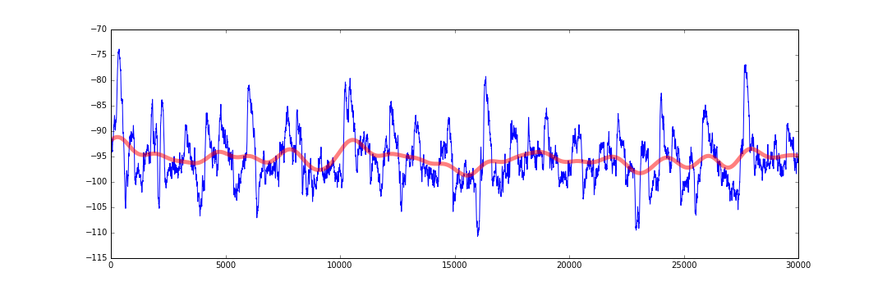
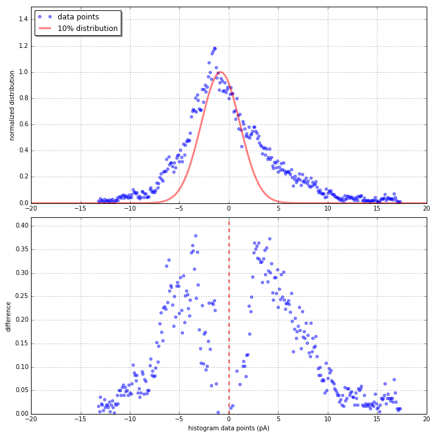

I challenged this problem a few different ways. My preferred way is to [use the variance](variance method) to estimate (and subtract-out) the noise, leaving only phasic currents. Older methods include event detection and lowpass filtering for subtraction.

