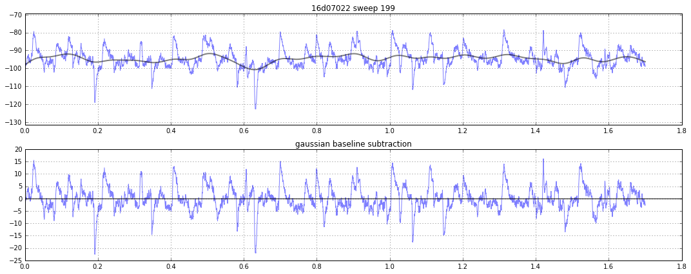
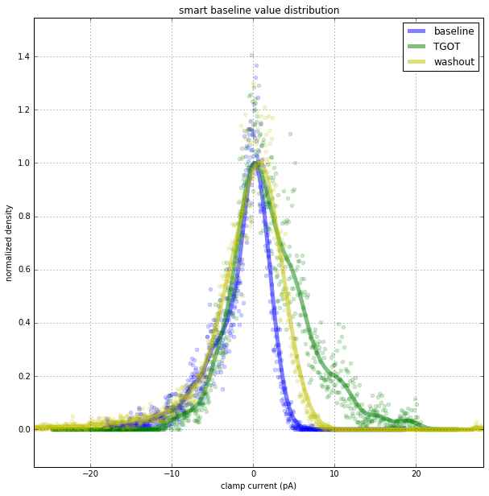
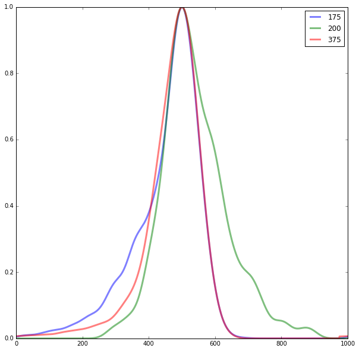
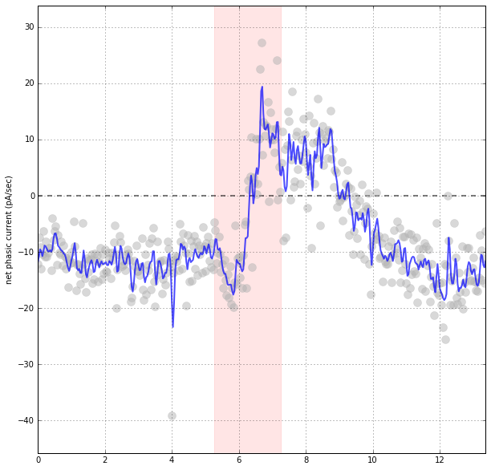

# Challenge
Quantify EPSCs and IPSCs at the same time. Their overlapping and small nature makes them too difficult to reliably capture via traditional event detection methods. Lots of things were tried, many of which are [documented in the old readme](readme_old.md). This is a description of what seems to work the best.

## Start with Smart Baseline Subtraction
baseline (EPSCs) | drug (EPSCs and IPSCs)
---|---
 | 

## Histogram data from every sweep
Histograms are normalized to 1, then aligned to their peak. RMS noise is expected to create a gaussian shape in the center. Anything outside of that is the biological _phasic current_ we are trying to isolate.

 |  | 
---|---|---

## Subtract positive from negative histogram
- We expect RMS noise to be identical on both sides of 0, so it eliminates itself.
- The difference is the _net phasic current_ which may be positive, net-neutral, or negative
- this code is in [13.py](13.py)

baseline | drug | washout
---|---|---
 |  | 

## Plot the difference with respect to time
- code is in [15.py](15.py)
- Summed units (pA) are then divided by the length of data used to make the result, leaving the units as pA/sec. 


 
# Solution (now in SWHLab core class)
```python
abf=swhlab.ABF("16d07022.abf")
for sweep in abf.setsweeps():
    print("Sweep",sweep,"phasic current is",abf.phasicNet())
```


```
Sweep 0 phasic current is -7.84370105278
Sweep 1 phasic current is -3.92867583759
Sweep 2 phasic current is -4.68253583272
Sweep 3 phasic current is -7.2651550911
Sweep 4 phasic current is -5.6990834645
Sweep 5 phasic current is -3.04249607924
Sweep 6 phasic current is -6.49318707287
Sweep 7 phasic current is -4.33582645295
Sweep 8 phasic current is -7.28951428466
...
```
