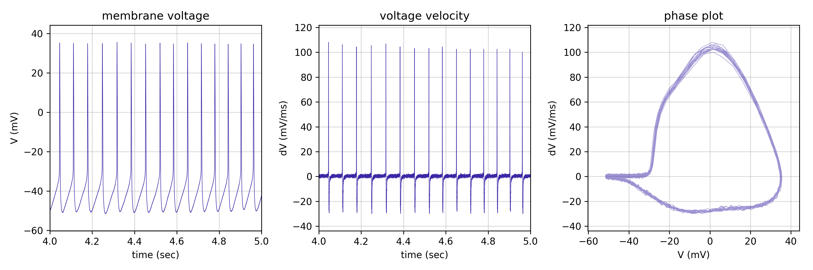
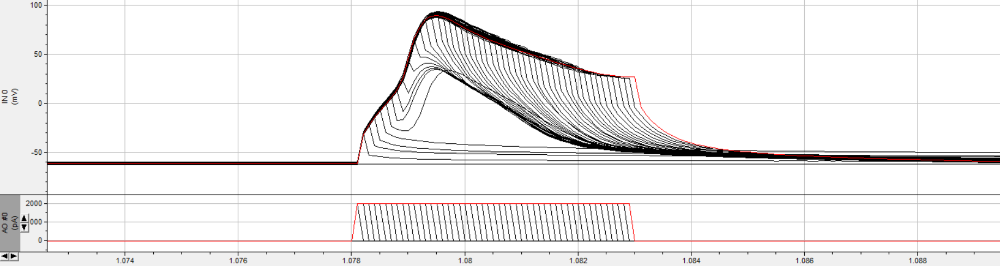

# Phase Plots
An action potential (AP) phase plot shows membrane voltage (V) on the horizontal axis and its derivative (dV) on the vertical axis. This forms a loop which goes in a clockwise circle once per AP. This example is a single sweep of a neuron which is continuously firing.

## Features you can determine from a phase plot
* **threshold voltage** - the voltage where the dV shoots-up from zero
* **maximum depolarization velocity** - the highest point on the vertical axis
* **maximum repolarization velocity** - the lowest point on the vertical axis
* **AP peak** - the right-most point on the graph
* **resting potential** - the voltage where the cell spends the most time / the site of the most overlapping points
* **multiple active currents** - a single active channel will produce a smooth single "hump" on the top of the curve or on the bottom of the curve. A bimodal "hump" indicates multiple channels (with different kinetics / voltage sensitivities) are at work. A bimodal depolarization curve can be used to distinguish axonal vs. somatic/dendritic origination of APs. A bimodal repolarization curve is typical of principle neurons and frequently absent in fast-spiking interneurons.

## Overlapping Phase Plots by Sweep
Overlaying all phase plots for all sweeps (color-coded) lets you know how different protocols influence the AP phase plot. This example is the same data as the earlier example, but shown for all sweeps (not just the last sweep). In this ramp protocol, current injection is slowly ramped-up each sweep. This allows for the most natural APs (and cleanest phase plots). Notice how precisely you can determine the threshold voltage from the phase plot, but how imprecise it is from the voltage plot.

## Step Protocol
Step protocols have slightly less natural APs, but can still be interpreted.

## APs Induced by Strong Current Injection
Sometimes APs are induced at specific time points by injecting extremely large (2nA) current pulses into the soma. Although this is effective at initiating APs, it is preventative to _recording_ meaningful phase plots. This is largely because the first derivative (vertical axis) is essentially destroyed by the current applied to the cell.

In this example you can see something which resembles an AP phase diagram (the upper right portion of the plot). However, the massive instantaneous changes in dV (from 0 to 300 mV/ms, then 0 to -300 mV/ms) interfere with the shape dramatically. This example uses a 5ms pulse. Varying the width of the current pulse moves the location of this interfering artifact to differnt points in the phase plot. Since APs are all-or-nothing, there is little effect on the phase plot until the pulse is too short to initiate an AP.

## Assessing Current Pulse Width on AP Phase Plot
A protocol was devised to apply 2nA pulses for an ascending series of widths in 0.1ms steps from 0ms to 5ms over 50 sweeps.

The first several sweeps depolarize the cell but do not produce an AP. This is evident in the phase plot as purple circles which do not have a sharp rise at the threshold voltage. Once threshold is reached, the AP height no longer changes. The only thing that changes is the location of the negative dV artifact caused by the -2nA current change.

