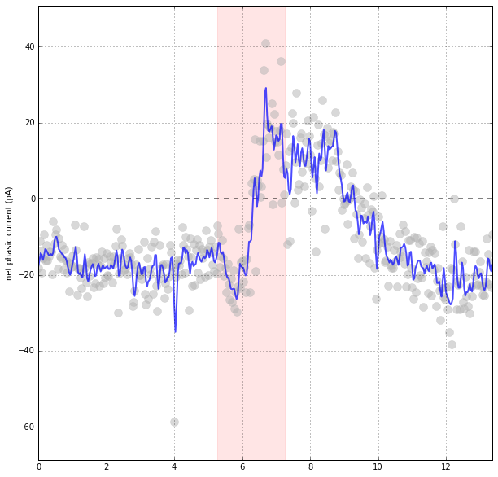

# SWHLab Real World Use Cases

Use Case | Graphic
---|---
[Calculate the _net effect_ of EPSCs and IPSCs recorded at the same time](EPSCs-and-IPSCs) using voltage clamp recordings at -50mV with low [Cl] to yield traces with EPSC/IPSC deflections in opposite directions. | 
[Remove 60 Hz fundamental and harmonic noise](spectral-noise) from poor quality recordings while maintaining sharp resolution of fast transients (like membrane tests, EPSCs, and IPSCs) | 
