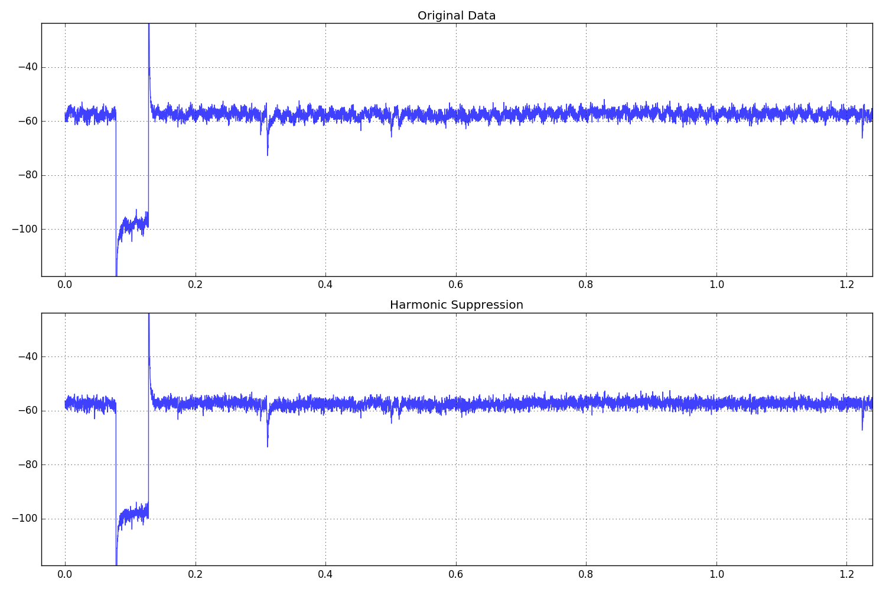
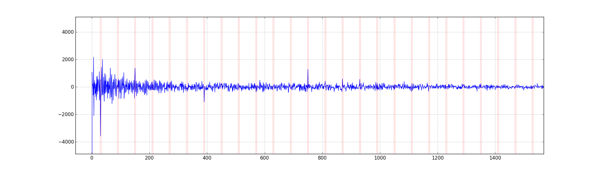
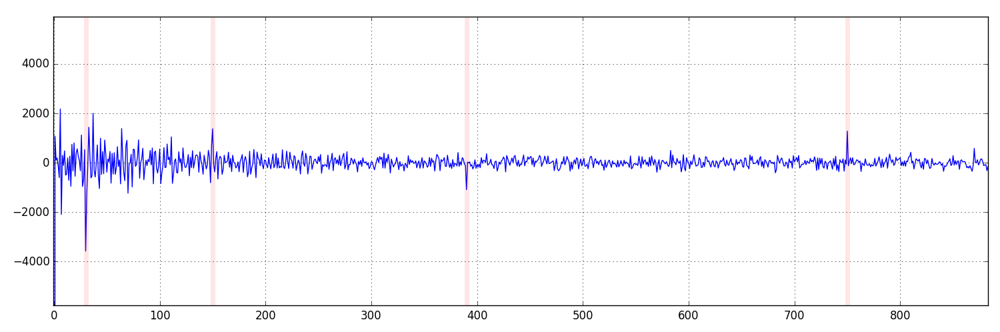

# Spectral Noise Reduction
The code in [01.py](01.py) outlines how to take a noisy electrophysiological recording and improve it. The assumption is that the noise is 60 Hz and its harmonics.

### Steps
- **convert data into frequency domain with FFT** - frequency units can be difficult to work with. Usually the array that comes out is a mirrored (real/imaginary) trace where the horizontal axis is frequency (starting at real 0, peaking to length(data)/2 in the center, and ending back at imaginary 0) and the vertical frequency is the power of that frequency in i/j units. Note that the maximum frequency you can measure is the number of data points/2. Also your frequency units are multiplied by the ratio of the number of your data points measured and your sample rate.
- **Set FFT[I]=0 where I is odd harmonics** - if you've figured out your horizontal axis untits, this becomes trivial. You _may_ decide to only silence odd harmonics, but it probably won't produce much differnece on the output.
- **convert data into time domain with iFFT** - this will output your smoothed trace and you're done.

### Result


---

# Advanced Notes
## Benchmark
Benchmark tests ([02.py](02.py)) revealed that this FFT can be performed unnoticably fast. Analyzing every sweep of the above ABF using this method produced the following report. Note that the time an FFT and iFFT takes to complete increases exponentially with sweep length.
```
analyzing 60 sweeps (5.00 sec each)
analysis took 6.47 +/- 1.71 ms per sweep
```


## Frequency component of this signal
Plotting the raw frequency component and highlighting 60 Hz and every third harmonic, it becomes evident that not every odd harmonic is an offender. I could selectively silence just the bad ones, but it doesn't make a huge difference as compared to just silencing all of them.

 | 
---|---
