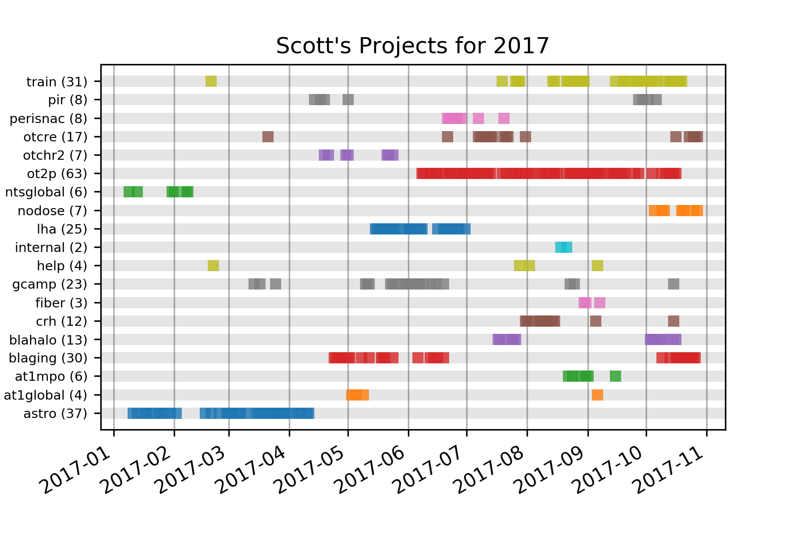

# Project Log
This is the script I use to keep track of how many days I devote to various projects. It creates a graphic indicating which projects I worked on and when I contributed to them.

## Sample Output

## Workflow
* I add to the log daily via Google Sheets ([screenshot](sheets.png))
  * It can be done on a computer or on my phone
  * One-word project nicknames indicate approximately what I worked on each day
  * The [Active Folders tool](https://github.com/swharden/SWHLab/tree/master/swhlab/tools/activeFolders) helps for dates long ago
* Export the data from Google Sheets (download as CSV)
* Analyze the data with [analyze.py] to create the output figure
