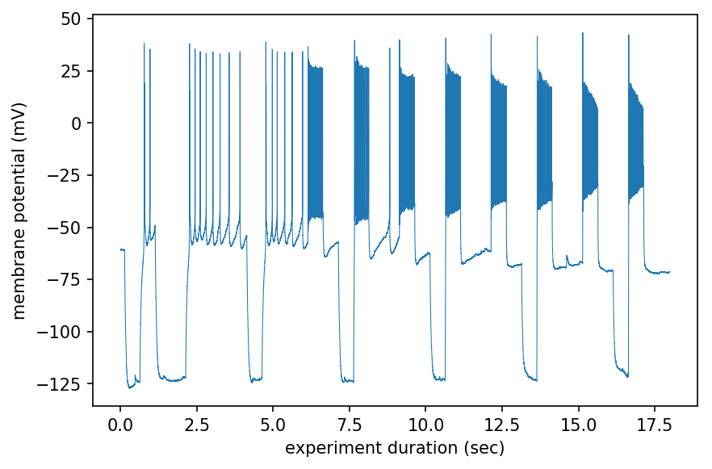

# Brute Force Extraction of ABF data
The ABFFIO.DLL is a nightmare. Why should an ABF file be more complex than a WAV file? Let's hack some basic functionality. This page will chronicle some hacks in this direction

# Examples

### minimal case
This example shows how to open an ABF file as a byte string then create an n-dimensional numpy array from it assuming the bytes are 16-bit integers. We can demonstrate it worked by graphing it. Some header at the beginning and end isn't data we want to graph so it's discarded. Also there's a 32-bit conversion (2^5) that needs to be adjusted for to return to raw voltage units. Also we can assume a 20 kHz sample rate.
```python
with open("17515019.abf",'rb') as f: raw=f.read() # read file as binary
data=np.ndarray(shape=(int(len(raw)/2),),dtype='<i2',buffer=raw) # make int16 array
data=data[3000:-500] # trim off the header
Ys=data/(2**5) # ADC to unit via to voltage with multiplication offset
Xs=np.arange(len(data))/20000 # create Xs from sample rate
plt.plot(Xs,Ys)
plt.ylabel("membrane potential (mV)")
plt.xlabel("experiment duration (sec)")
```


