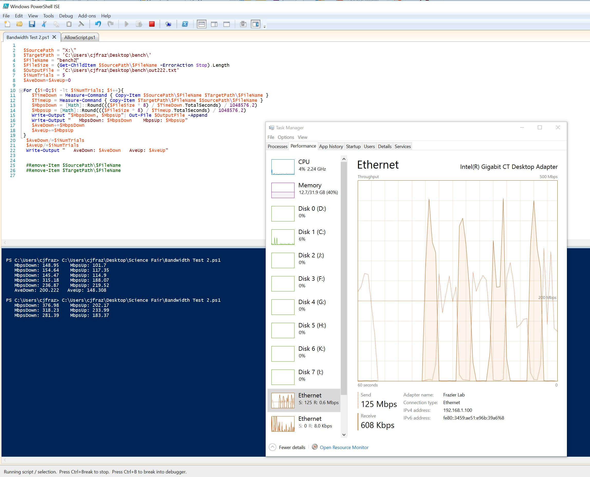

# X-Drive Stress Test
This script will stress the X-Drive in two ways:
* copying a 500MB file to the local computer
* manually seaching every folder in a large tree
Each will be done 5 times and the result averaged.
* now uses `xcopy` instead of `shutil.copy()`

## Python Solution
Use Python 3 to run the contents of [networkTest.py](networkTest.py)

#### Output
```
walking the entire tree of: X:\Data\DIC2\2014
(1/5) scanned 976 folders in 9.959 seconds
(2/5) scanned 976 folders in 8.234 seconds
(3/5) scanned 976 folders in 6.439 seconds
(4/5) scanned 976 folders in 5.795 seconds
(5/5) scanned 976 folders in 6.651 seconds
Average time for 5 runs: 7.416 seconds

copying a HUGE file: X:\...\2017-05-11 cell3_annotated.tif
(1/5) copy took 11.413 seconds (38.470 MB/s)
(2/5) copy took 12.155 seconds (36.122 MB/s)
(3/5) copy took 15.876 seconds (27.655 MB/s)
(4/5) copy took 25.751 seconds (17.050 MB/s)
(5/5) copy took 24.775 seconds (17.722 MB/s)
Average time for 5 runs: 17.994 seconds
```

# Powershell Solution
_You have to run the one line in AllowScript, then you can execute bandwidthtest2.ps1 from your computer in the Powershell ISE.  If you want to do this you’d need to change the local path to match something on your computer._

**AllowScript:**
```PowerShell
Set-ExecutionPolicy -Scope Process -ExecutionPolicy Unrestricted
```

**networkTest:**
```PowerShell
$SourcePath = "J:\"
$TargetPath = 'C:\Users\cjfraz\Desktop\bench\'
$FileName = "bench2"
$FileSize = (Get-ChildItem $SourcePath\$FileName -ErrorAction Stop).Length
$OutputFile = 'C:\Users\cjfraz\Desktop\bench\out222.txt'
$iNumTrials = 5
$AveDown=$AveUp=0

For ($i=0;$i -lt $iNumTrials-1; $i++){
   $TimeDown = Measure-Command { Copy-Item $SourcePath\$FileName $TargetPath\$FileName }
   $TimeUp = Measure-Command { Copy-Item $TargetPath\$FileName $SourcePath\$FileName }
   $MbpsDown = [Math]::Round((($FileSize * 8) / $TimeDown.TotalSeconds) / 1048576,2)
   $MbpsUp = [Math]::Round((($FileSize * 8) / $TimeUp.TotalSeconds) / 1048576,2)
   Write-Output "$MbpsDown, $MbpsUp"| Out-File $OutputFile -Append
   Write-Output "   MbpsDown: $MbpsDown    MbpsUp: $MbpsUp"
   $AveDown+=$MbpsDown
   $AveUp+=$MbpsUp
}
 $AveDown/=$iNumTrials
 $AveUp/=$iNumTrials
 Write-Output "   AveDown: $AveDown   AveUp: $AveUp"
```

#### Output

